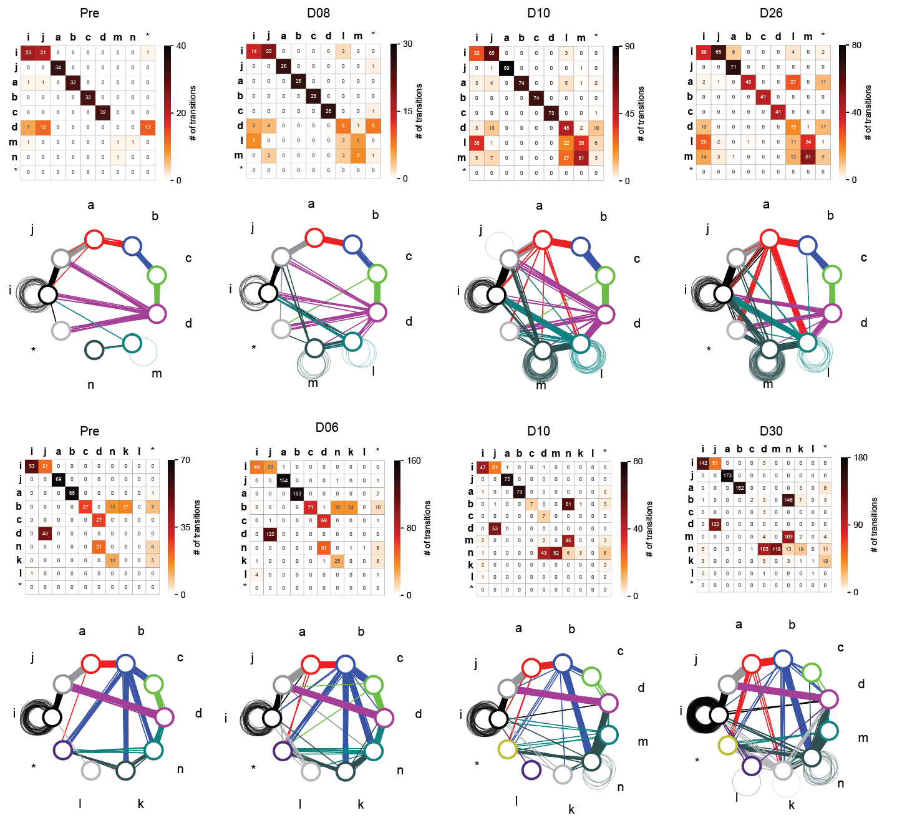

# Syllable Network Analysis

[](https://www.python.org/downloads/)
[](https://opensource.org/licenses/MIT)

A comprehensive Python package for analyzing syllable sequence variability over time in bird songs. This project provides tools for building transition matrices, calculating entropy metrics, and visualizing syllable networks.

## 🎯 Features

- **Transition Matrix Analysis**: Build and analyze syllable transition matrices
- **Network Visualization**: Create beautiful syllable transition diagrams
- **Entropy Metrics**: Calculate transition entropy and sequence complexity
- **Sequence Analysis**: Measure linearity, consistency, and stereotypy
- **Modular Architecture**: Clean, maintainable code structure

## 📁 Project Structure

```
syllable_network_analysis/
├── src/                           # Source code
│   └── syllable_network_analysis/
│       ├── analysis/              # Core analysis functions
│       ├── plot/                  # Plotting and visualization
│       └── utils/                 # Utility functions
├── notebooks/                     # Jupyter notebooks
├── tests/                         # Test suite
├── data/                          # Data files
│   ├── raw/                       # Raw data files
│   ├── processed/                 # Processed data
│   └── interim/                   # Intermediate data
├── reports/                       # Generated reports and plots
├── configs/                       # Configuration files
├── scripts/                       # Analysis scripts
```

````

## 🚀 Quick Start

### Installation

1. Clone the repository:

```bash
git clone https://github.com/yourusername/syllable_network_analysis.git
cd syllable_network_analysis
````

2. Install the package:

```bash
pip install -e .
```

### Basic Usage

```python
from syllable_network_analysis.analysis import (
    get_trans_matrix,
    get_syllable_network,
    get_trans_entropy
)

# Analyze syllable sequence
syllables = "abcabc"
note_seq = "abc"

# Build transition matrix
trans_matrix = get_trans_matrix(syllables, note_seq)

# Get syllable network
syl_network = get_syllable_network(trans_matrix)

# Calculate entropy
entropy = get_trans_entropy(trans_matrix)
print(f"Transition entropy: {entropy:.4f}")
```

### Visualization

```python
from syllable_network_analysis.plot import plot_transition_diag
import matplotlib.pyplot as plt

fig, ax = plt.subplots(1, 1, figsize=(10, 10))
plot_transition_diag(ax, note_seq, syl_network, syl_color)
plt.show()
```

## 📊 Example Output



## 🔬 Analysis Methods

### Transition Entropy

Measures the uncertainty in syllable transitions. Higher entropy indicates more variable sequences.

### Sequence Linearity

Ratio of unique syllables to unique transitions, indicating how linear the sequence is.

### Sequence Consistency

Proportion of transitions that follow the most common pattern.

### Song Stereotypy

Combined measure of linearity and consistency, indicating overall song stereotypy.

## 📞 Contact

- **Email**: jaerongahn@gmail.com
